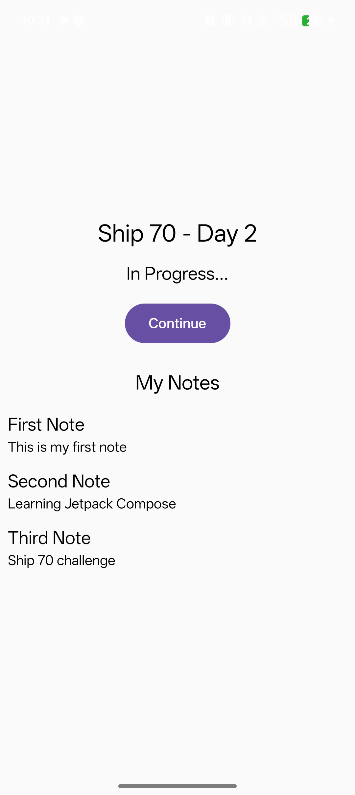
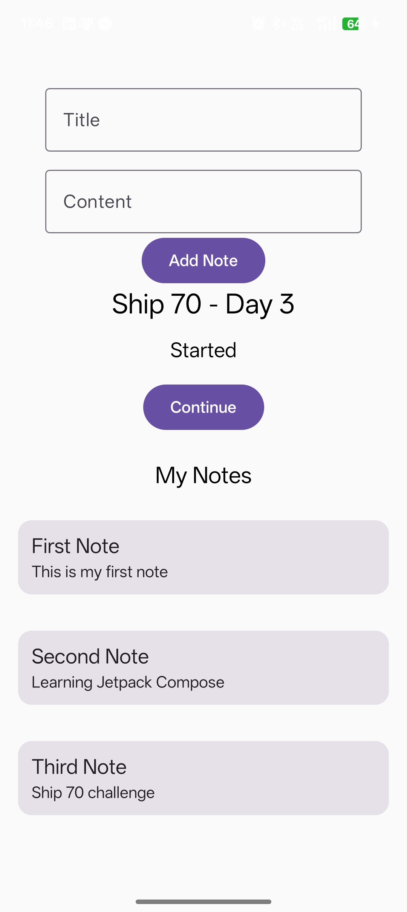

# 📒 Smart Notes App (Ship 70 Challenge)

Building a Smart Notes app in 70 days using **Android, Kotlin, and Jetpack Compose**.

---

## 🚀 Goal
- Build real projects daily  
- Learn by building (not just watching tutorials)  
- Become consistent and production-focused  

---

## 📅 Progress

### ✅ Day 1
- Project setup in Android Studio  
- Built basic UI using Jetpack Compose  
- Learned state handling (`remember`, `mutableStateOf`)  

---

### ✅ Day 2
- Implemented Notes List using `LazyColumn`  
- Created reusable `NoteItem` component  
- Understood list rendering in Compose  

---

### ✅ Day 3
- Added Note input (Title + Content)  
- Implemented dynamic note addition  
- Improved UI (cards, spacing, alignment)  

---

## 📱 Screenshots

| Day 2 | Day 3 |
|------|------|
|  |  |

---

## 🛠 Tech Stack
- Kotlin  
- Jetpack Compose  
- Android Studio  

---

## 📌 Features (Current)
- Add notes (Title + Content)  
- Display notes dynamically  
- Clean UI with reusable components  

---

## 🔜 Upcoming
- Edit / delete notes  
- Persistent storage (Room Database)  
- Navigation between screens  
- UI/UX improvements  

---

## 📈 Learning Approach
This project focuses on:
- Understanding concepts deeply  
- Building from scratch  
- Improving through daily iteration  
- Thinking like a developer, not just a learner  

---

## 👤 Author
**Mohammed Sahil**  
[LinkedIn](https://www.linkedin.com/in/mdsahil01/)  
[GitHub](https://github.com/Mdsahil01)
